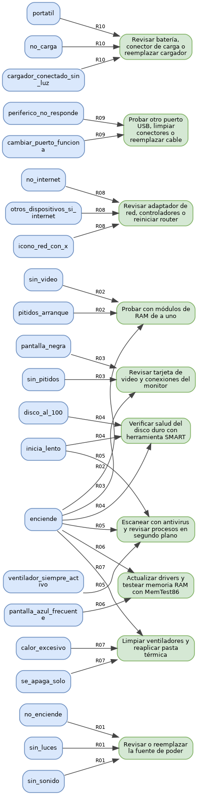

# Sistema Experto — Diagnóstico de Problemas Técnicos en Computadoras

---

## Componentes del sistema experto

El código organiza los cinco componentes clásicos de un sistema experto:

1. **Base de conocimiento** (`BASE_DE_CONOCIMIENTO`): es la representación del conocimiento del experto. Cada regla contiene un identificador, una descripción, un conjunto de condiciones (síntomas), una conclusión (diagnóstico/recomendación) y un factor de confianza numérico entre 0 y 1.
2. **Base de hechos** (`base_de_hechos`): es la memoria de trabajo. Se representa como un `set` de Python con los síntomas confirmados durante la consulta. Usar `set` acelera la equiparación, porque la verificación de condiciones se reduce a `issubset`.
3. **Motor de inferencia**: contiene las funciones de **equiparación** (`equiparar`), **resolución de conflictos** (`resolver_conflictos`) y **ejecución** (`inferir`). El motor aplica encadenamiento hacia adelante: recorre las reglas, detecta cuáles se disparan y elige la mejor según confianza y especificidad.
4. **Interfaz de explicación**: dentro de `inferir` se imprime qué regla se activó, cuáles síntomas la activaron, qué otras reglas competían y por qué se descartaron. Esto permite trazar el razonamiento.
5. **Interfaz de usuario**: es el menú interactivo (`main`/`menu`/`consultar`) que pregunta síntomas al usuario, llama al motor y presenta resultados.

---

## Ajustes realizados al código base

El código entregado estaba funcional pero tenía áreas que completé y ajusté:

- **Eliminación del estado global**: la base de hechos ya no es una variable global mutable. Se crea con `crear_base_de_hechos()` y se pasa explícitamente a las funciones, lo que facilita las pruebas y evita que una consulta anterior contamine la siguiente.
- **Menú de opciones**: se reemplazó la ejecución directa por un menú que permite elegir entre diagnóstico principal, ranking de diagnósticos, encadenamiento hacia atrás y exportación de la red.
- **Validación de entrada**: las respuestas del usuario aceptan `s` (sí), `n` (no), `Enter` (omitir) o `q` (cancelar).
- **Preguntas asociadas**: el diccionario `PREGUNTAS` se mantiene separado de la base de conocimiento, pero se usa tanto para consultar síntomas como para el encadenamiento hacia atrás, de modo que el sistema puede formular preguntas legibles.

---

## Desafíos implementados

Se implementaron **cuatro desafíos** de extensión.

### Nivel 1 — Agregar 3 reglas nuevas

Se añadieron las reglas `R08`, `R09` y `R10` con nuevos síntomas y diagnósticos:

| Regla | Síntomas | Conclusión | Confianza |
|---|---|---|---|
| R08 | `no_internet`, `otros_dispositivos_si_internet`, `icono_red_con_x` | Revisar adaptador de red, controladores o reiniciar router | 0.82 |
| R09 | `periferico_no_responde`, `cambiar_puerto_funciona` | Probar otro puerto USB, limpiar conectores o reemplazar cable | 0.78 |
| R10 | `portatil`, `no_carga`, `cargador_conectado_sin_luz` | Revisar batería, conector de carga o reemplazar cargador | 0.84 |

La función `equiparar` detecta automáticamente estas reglas cuando todos sus síntomas están presentes en la base de hechos.

### Nivel 2 — Múltiples diagnósticos ordenados por confianza

Se agregó `diagnosticos_ordenados(conflict_set)` y la opción `modo_ranking` en `inferir`. En lugar de devolver solo el diagnóstico de mayor confianza, el sistema muestra **todos los diagnósticos posibles** ordenados de mayor a menor confianza; en empate, gana la regla con más condiciones (más específica). Esto le da al usuario una visión completa del ranking de hipótesis.

### Nivel 3 — Encadenamiento hacia atrás

Se implementó `backward_chain(meta, base_conocimiento, hechos)`. Dado un diagnóstico específico, la función recorre recursivamente las reglas que concluyen esa meta y descompone cada condición en submetas. Si una submeta no se puede derivar de ninguna regla, se reporta como una pregunta que el usuario debería confirmar. El resultado se imprime con `imprimir_arbol_backward` como un árbol de razonamiento.

### Nivel 4 — Exportar red de inferencia

Se implementó `exportar_red(base_conocimiento)`. Recorre todas las reglas y genera un diccionario con dos llaves:

- `nodos`: lista ordenada de todos los hechos (síntomas) y conclusiones (diagnósticos).
- `aristas`: lista de relaciones `condición -> conclusión`, etiquetadas con el identificador de la regla.

El resultado se imprime como JSON usando `json.dumps`.

---

## Cómo ejecutar

```bash
python3 main.py
```

Selecciona una opción del menú:

1. Diagnóstico principal (un resultado)
2. Ranking de diagnósticos (todos ordenados por confianza)
3. Encadenamiento hacia atrás (indica un diagnóstico/meta)
4. Exportar red de inferencia a JSON
5. Salir

---

## Reflexiones

### 1. ¿Cuál es la diferencia principal entre un sistema experto y un programa de software tradicional?

Un programa tradicional sigue un flujo de control fijo definido por el programador. Un sistema experto, en cambio, separa el **conocimiento** (reglas) del **razonamiento** (motor de inferencia) y puede llegar a conclusiones flexibles en función de los hechos ingresados, sin que el flujo exacto esté codificado de antemano.

### 2. ¿Por qué se dice que los sistemas expertos tienen conocimiento separado de su motor de razonamiento? ¿Cuál es la ventaja?

Porque las reglas se almacenan en una base de conocimiento que el motor interpreta, pero no depende de él. La ventaja es que se puede **modificar, ampliar o especializar el conocimiento** sin reescribir el motor. Por ejemplo, agregar una nueva regla de diagnóstico no requiere cambiar la lógica de equiparación.

### 3. ¿Qué es la base de hechos y en qué se diferencia de la base de conocimiento?

La **base de conocimiento** contiene las reglas generales del experto (IF-THEN). La **base de hechos** contiene los datos concretos del caso actual (síntomas confirmados por el usuario). Una es conocimiento estático; la otra es memoria de trabajo dinámica.

### 4. ¿Qué significa que un sistema experto pueda "explicar su razonamiento"? ¿Por qué es importante en medicina o derecho?

Significa que puede mostrar qué reglas activó, qué condiciones se cumplieron y por qué descartó otras hipótesis. En medicina y derecho es vital porque las decisiones tienen consecuencias graves: médicos y jueces deben poder auditar, validar y confiar en el razonamiento, no solo en el resultado.

### 5. ¿Por qué fracasaron comercialmente los sistemas expertos en los años 90? Menciona al menos 3 razones.

1. **Adquisición del conocimiento costosa**: extraer reglas de expertos humanos era lento, caro y difícil de mantener.
2. **Fragilidad**: funcionaban bien dentro de su dominio, pero fallaban estrepitosamente ante situaciones ligeramente diferentes (falta de sentido común).
3. **Escalabilidad limitada**: a medida que crecía la base de reglas, el mantenimiento y la resolución de conflictos se volvían inmanejables.

### 6. Dada la regla: `SI (fiebre AND tos) OR perdida_olfato ENTONCES sospecha_covid` y los hechos `{fiebre=True, tos=False, perdida_olfato=True}` — ¿Se activa la regla? ¿Por qué?

Sí se activa. Evaluando:

- `(fiebre AND tos)` = `True AND False` = `False`
- `False OR perdida_olfato` = `False OR True` = `True`

Por lo tanto, la premisa es verdadera y se dispara la regla.

### 7. Completa la tabla de verdad para `(A AND NOT B) OR (NOT A AND B)`

| A | B | NOT B | A AND NOT B | NOT A | NOT A AND B | (A AND NOT B) OR (NOT A AND B) |
|---|---|-------|-------------|-------|-------------|--------------------------------|
| T | T | F     | F           | F     | F           | F |
| T | F | T     | T           | F     | F           | T |
| F | T | F     | F           | T     | T           | T |
| F | F | T     | F           | T     | F           | F |

Esta expresión es la función **XOR** (OR exclusivo): es verdadera cuando A y B tienen valores diferentes.

### 8. ¿Cuál es la diferencia entre encadenamiento hacia adelante y hacia atrás? Da un ejemplo real de cada uno.

- **Hacia adelante (forward chaining)**: parte de los hechos conocidos y aplica reglas hasta llegar a conclusiones. Ejemplo: un médico ingresa los síntomas del paciente y el sistema infiere posibles enfermedades.
- **Hacia atrás (backward chaining)**: parte de una hipótesis/meta y busca los hechos necesarios para probarla. Ejemplo: un detective asume que un sospechoso es culpable y luego verifica si las pruebas (motivo, oportunidad, evidencia) lo confirman.

### 9. Diseña 3 reglas IF-THEN para un sistema experto que asesore a estudiantes sobre qué lenguaje aprender primero

```text
R1: SI objetivo = desarrollo_web ENTONCES recomendar Python o JavaScript
R2: SI objetivo = analisis_de_datos ENTONCES recomendar Python
R3: SI objetivo = desarrollo_videojuegos ENTONCES recomendar C# con Unity o C++
```

### 10. Dibuja la red de inferencia correspondiente a las 3 reglas anteriores



Nodos: `desarrollo_web`, `analisis_de_datos`, `desarrollo_videojuegos`, `Python o JavaScript`, `Python`, `C# con Unity o C++`. Aristas: cada objetivo apunta a su recomendación a través de su regla.

### 11. ¿Qué problema de diseño podría surgir si dos reglas tienen exactamente las mismas condiciones pero conclusiones diferentes? ¿Cómo lo resolverías?

El problema es una **contradicción lógica**: el sistema produciría diagnósticos inconsistentes para los mismos síntomas. Se resolvería:

1. Revisando con el experto cuál conclusión es correcta y eliminando o corrigiendo la regla errónea.
2. Agregando más condiciones para diferenciar los casos en que aplica cada conclusión.
3. Usando un factor de confianza diferenciado y una política de resolución de conflictos explícita.

---

## Autor

Proyecto académico generado para la actividad *Motor de Inferencia en Python*.
